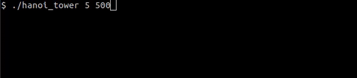

# hanoi_tower

A [Tower of Hanoi](https://en.wikipedia.org/wiki/Tower_of_Hanoi) solver written in C - it displays on your terminal!



Just for:
- fun!
- getting familiar with single-linked lists
- solving a problem with a simple recursive function

## Usage:
```
make
./hanoi_tower  n_rings  [time_ms]
```
Example: `./hanoi_tower 8 500` will solve for 8 rings, with a time interval of 500 ms between each move.  
*time_ms* defaults to 1 s if not informed.
